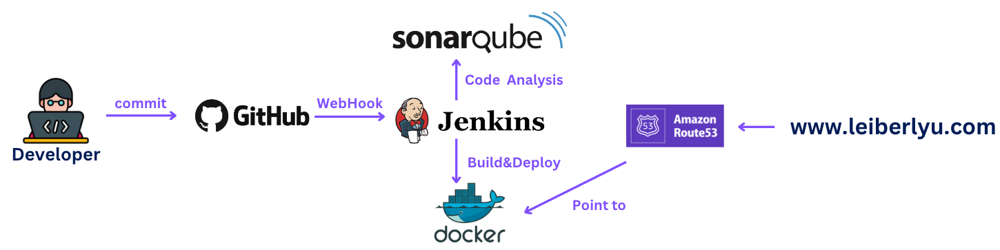

# **Continuous Integration and Continuous Deployment of Personal Website Project**

## Overview

This project involves setting up a personal website using Amazon Web Services (AWS) infrastructure, specifically leveraging EC2 instances. The architecture includes three EC2 servers, each dedicated to running SonarQube, Jenkins, and Docker services respectively. The source code is managed on GitHub, and an automated CI/CD pipeline ensures smooth and efficient deployment of updates. The frontend is served using Nginx to host the webpage, with HTML and CSS used for a simple display. If needed, it can be replaced with React or Angular frameworks for more advanced UI effects.

**Due to the high costs involved, this project has been taken offline.**

## Structure

When developer pushes new commits to the GitHub remote, a webhook is triggered, which interacts with Jenkins deployed on the first EC2 instance. When Jenkins detects new commits, it wakes up SonarQube deployed on the second EC2 instance to perform code checks. Jenkins then copies the code repository to the third EC2 server, where Docker is deployed. It runs the Dockerfile in the project, based on nginx, to create an image and run it locally, associating port 80 of the server with the port the container is running on. This allows access to the website through port 80 of the third EC2 instance. Finally, AWS Route 53 is used to enable access to the EC2 instance through a personal domain name.

## Website Screen Shot

## Solution Drawbacks

1. EC2 instances with substantial computing and storage capacity incur high costs. 

2. The project is only using HTML and CSS, which are considered outdated technologies, resulting in a dated page style.
